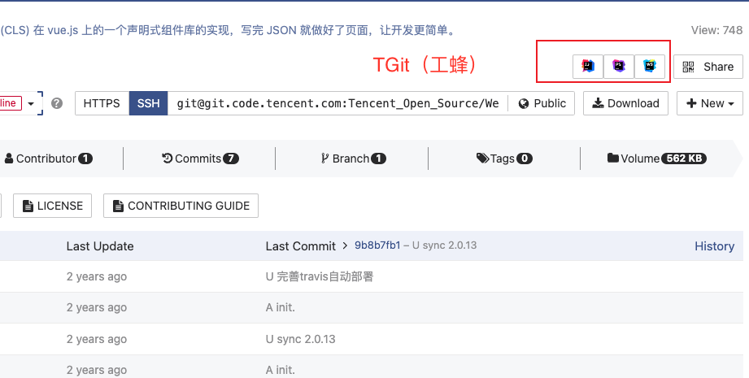
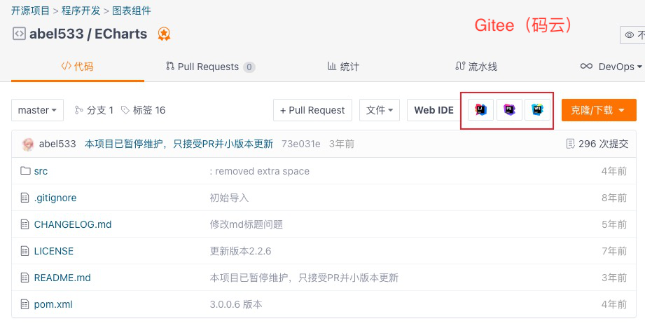

# JetBrains Toolbox App browser extensionx

JB官方插件[下载地址](https://chrome.google.com/webstore/detail/jetbrains-toolbox-extensi/offnedcbhjldheanlbojaefbfbllddna?utm_source=chrome-ntp-icon)
官方[仓库地址](https://github.com/JetBrains/toolbox-browser-extension)

这里是官方插件改进版，so x. 如果官方插件不能满足你的需求，请向下看。

## 增强点

1. 支持国内常用的Git服务`工蜂、Gitee`
2. 支持`markdown语言`命中IDE
3. 支持设置`activeIDE`，没有选中的IDE，不会作为IDE一键启动按钮
4. 支持设置`缺省IDE`，即任何仓库都会显示该IDE，作为兜底按钮
5. 支持非JB系IDE，比如`Visual Studio Code`

## 安装

1. [下载ZIP包](https://github.com/alanhg/toolbox-browser-extensionx/releases/tag/latest)
2. 解压缩
3. Chrome插件页面下打开开发者模式，加载解压后文件夹即可

## 说明

- 当前工蜂社区版版本较低，不支持语言统计接口，因此命中IDE会参考根目录下文件后缀
- 该repo不计划PR到官方repo中，这样也可方便加些个人认为重要的功能，未来如需要单独fork repo提交
